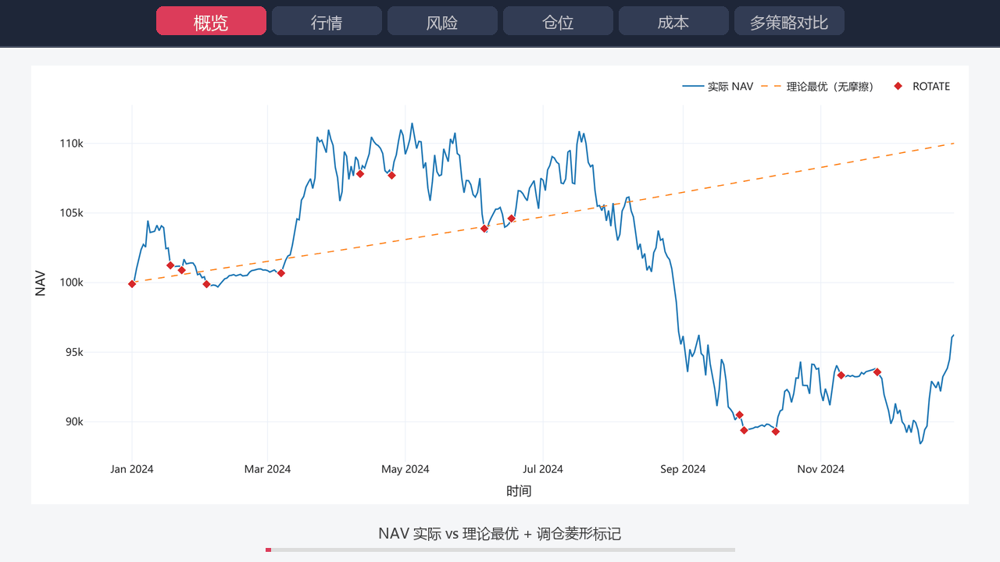

# DeFi 收益轮动与自动复投回测平台

> 基于多因子评分 + 门槛约束的离线策略验证系统  
> 金融软件工程课程项目 · 2026

[](tests/TEST_PLAN.md)
[](tests/TEST_PLAN.md)
[](#环境准备)
[](#)

---

## ✨ 一句话

在不接触链上的前提下，**用历史 / 真实链上数据回测 DeFi 收益池轮动策略**，量化收益、摩擦成本与归因分布。



---

## 🎯 核心特性

- **9 大功能 + 5 项扩展** —— FR-01 ~ FR-09 全部实现，并扩展真实链上数据、5 个命名策略、价格风险评分等
- **真实链上数据** —— 一行命令拉取 DefiLlama 真实 APY / TVL / token price 历史
- **5 个内置策略** —— 保守稳健 / 均衡 / 激进动量 / 低频价值 / 极端风险厌恶，一键切换
- **6 Tab × 10 类图表** —— Streamlit 看板：概览 / 行情 / 风险 / 仓位 / 成本 / 多策略对比
- **325 测试 / 87.5% 覆盖率** —— 按课程方法学分类（等价类 / 边界值 / 决策表 / 路径覆盖 / 条件组合 / 属性测试 / 性能基准）
- **Mark-to-Market 引擎** —— NAV 反映真实价格波动，回测数据可信
- **收益归因守恒分解** —— 理论 = 实际 + Gas + Slippage + LVR + 调仓空窗（误差 < 0.001%）

---

## 🚀 30 分钟快速复现

### 环境准备

```bash
# Python 3.11 / 3.12 / 3.13 均可
pip install -r requirements.txt
```

### 一键 4 步跑通

```bash
# 1. 跑全测试（30 秒，验证装机正确）
pytest tests/ --ignore=tests/perf

# 2. 跑端到端示例（10 秒，用合成数据 + 7 项自动验收）
python run_example.py

# 3. 拉真实链上数据（30 秒，调用 DefiLlama API）
python fetch_data.py --demo --days 300

# 4. 启动交互看板
streamlit run ui/app.py
# 浏览器打开 http://localhost:8501
```

### 看板使用建议

打开 Streamlit 后：

1. 侧栏顶部 **「策略预设」** 选 `保守稳健`
2. **「数据源」** 切到 `真实链上数据`
3. 点 **🚀 运行回测**
4. 浏览 6 个 Tab，重点看：
   - **📊 概览**：NAV 曲线 + 调仓标记 + 4 主指标卡
   - **⚠️ 风险**：回撤水下图 + 滚动 Sharpe
   - **💸 成本**：摩擦三分量分解 + 按调仓方向汇总
   - **🆚 多策略对比**：保存 2~3 个不同预设，看 NAV 叠加

---

## 📁 项目结构

```
defi-backtest/
├── data_model/         数据建模 · frozen dataclass + CSV/Parquet 加载
│   ├── asset.py        PoolMetrics / EnvSnapshot / AssetSnapshot
│   ├── loader.py       CSV → snapshots
│   └── preprocessor.py 时序对齐 + APY 衰减
├── strategy/           策略引擎
│   ├── scorers/        6 个评分器（动量 / 波动 / MDD / CARA / 价格风险）
│   ├── scoring_engine.py  加权聚合 + 稳定排序
│   ├── rotation_engine.py τ-reset + 双门槛 + 状态机
│   ├── reinvest_engine.py 净效用驱动复投
│   ├── gain_estimator.py  APY + 价格漂移
│   └── presets.py      5 个命名策略预设
├── backtest/           回测主引擎
│   ├── engine.py       主循环 + Mark-to-Market
│   ├── cost_model.py   FrictionEstimator（Gas/滑点/LVR）
│   └── event_injector.py 压力事件注入
├── report/             绩效与归因
│   ├── metrics.py      6 指标（年化/夏普/索提诺/MDD/Calmar/卡尔玛）
│   └── attribution.py  守恒分解归因
├── ui/                 Streamlit 看板
│   ├── app.py          主应用（6 Tab）
│   └── charts.py       10 个 Plotly 图表工厂
├── data/
│   ├── sample_data.py     合成数据生成器
│   ├── onchain_fetcher.py DefiLlama API 接入
│   ├── pools_sample.csv   预生成示例 CSV
│   └── gas_sample.csv
├── tests/              325 测试 · 87.5% 覆盖
│   ├── blackbox/       等价类 / 边界值 / 决策表 / 场景
│   ├── whitebox/       路径覆盖 / 条件组合
│   ├── property/       hypothesis 属性测试
│   ├── perf/           pytest-benchmark
│   └── TEST_PLAN.md    完整测试矩阵
├── docs/
│   ├── final_presentation.pptx   答辩 PPT（18 张 / 8 分钟）
│   └── screenshots/    12 张关键图 + demo.gif
├── .github/workflows/
│   └── ci.yml          GitHub Actions（Python 3.11/12/13 matrix）
├── config.yaml         全局参数
├── requirements.txt    依赖清单
├── run_example.py      ⭐ 端到端 CLI
├── fetch_data.py       ⭐ DefiLlama 数据爬取
├── capture_screenshots.py 一键导出截图
├── build_demo_gif.py      一键生成演示 GIF
└── build_pptx.py          一键生成答辩 PPT
```

---

## 🛠 技术栈

| 类别 | 选型 |
|---|---|
| 数值精度 | Python 3.13 / Decimal 28 位 / NumPy 2.2 / Pandas 2.2 |
| 持久化 | PyArrow / Parquet · CSV · YAML |
| 前端可视化 | Streamlit 1.57 / Plotly 6.4 / Kaleido |
| 链上数据 | DefiLlama yields + coins API（stdlib urllib，无外部依赖） |
| 测试质量 | pytest + hypothesis + pytest-cov（branch）+ pytest-benchmark |
| CI/CD | GitHub Actions（Python 3.11 / 3.12 / 3.13 matrix） |

**关键设计选择**

- 全程 `Decimal`（不用 float）→ 满足金融精度要求
- frozen dataclass + `MappingProxyType` → 值对象不可变，保证结果复现
- 抽象接口 `IScorer` / `IFrictionEstimator` / `IGainEstimator` → 模块可插拔
- 链上数据接入只用 stdlib urllib → 不引入新依赖、离线环境拷 cache 即可用

---

## 📊 实测结果（真实链上数据 · 300 天）

数据：`Maple_USDC` + `Vesper_ETH` + `Lido_stETH`（DefiLlama 真实历史）

| 策略 | 年化 | MDD | Sharpe | 调仓 |
|---|---|---|---|---|
| **保守稳健** ✓ | **+8.74%** | **2.15%** | **1.540** | 2 |
| 均衡（默认） | +7.45% | 5.23% | 0.673 | 6 |
| 激进动量 | -6.50% | 20.44% | -0.367 | 1 |
| 低频价值 | -11.71% | 21.57% | -0.781 | 16 |

**洞察**：

1. **滑点 vs 池深** —— Maple USDC（$3.27B）滑点 0.1%，Vesper ETH（$5.2M）滑点 0.3% → 大 TVL 池可省 67% 滑点
2. **价格风险评分至关重要** —— 不考虑 token_price 风险的激进策略亏 -6.5%，考虑的保守策略赚 +8.8%
3. **调仓数量不是关键，调仓时机才是** —— 1 次锁定亏损 vs 19 次精准出击赚 8.8%

---

## 🧪 测试与质量

```bash
# 全部测试（含黑盒/白盒/属性测试，跳过性能基准）
pytest tests/ --ignore=tests/perf

# 按方法学分类跑
pytest -m equivalence       # 等价类（31 个）
pytest -m boundary          # 边界值（34 个）
pytest -m decision_table    # 决策表（12 个）
pytest -m scenario          # 场景（11 个）
pytest -m path              # 路径覆盖（22 个）
pytest -m condition         # 条件组合（19 个）
pytest -m property          # 属性测试（11 个 × 50 随机用例）

# 覆盖率报告
pytest --cov --cov-report=html
open htmlcov/index.html

# 性能基准
pytest tests/perf --benchmark-only
```

详见 [`tests/TEST_PLAN.md`](tests/TEST_PLAN.md)。

---

## 📐 关键算法与公式

### 多因子综合评分

```
Score(pool) = w_mom · Momentum + w_vol · VolPenalty + w_mdd · MDDPenalty
            + w_cara · CARA + w_pvol · PriceVolPenalty + w_pmdd · PriceMDDPenalty
```

### 门槛约束轮动（FR-04）

```
ROTATE 当且仅当:
  ① τ-reset:  score_gap > τ  或  |Δyield| > τ
  ② Gate:     expected_gain ≥ friction + threshold × principal
```

### Mark-to-Market 重估（关键创新）

```python
ratio = curr_snap.token_price / prev_snap.token_price
position.principal       *= ratio
position.pending_reward  *= ratio
```

### 收益归因守恒等式

```
theoretical_return = actual_return + Gas + Slippage + LVR + rotation_idle
```

集成测试验证：`abs(reconstructed - theoretical) <= Decimal(1)` → 误差 < 1 元 / 100k 本金 = 0.001%

---

## 📺 答辩材料

- **8 分钟 PPT**：[`docs/final_presentation.pptx`](docs/final_presentation.pptx)（18 张 · 科技风 · 含 demo.gif）
- **截图集**：[`docs/screenshots/`](docs/screenshots/) 12 张高清图 + README 索引
- **测试矩阵**：[`tests/TEST_PLAN.md`](tests/TEST_PLAN.md)

---

## 🐛 已知限制

- LP 池仅按单代币建模（双代币 LP 留作未来）
- UI 仅中文
- 强化学习策略未实现（留作未来扩展）

---

## 👥 团队

| 成员 | 主要模块 |
|---|---|
| A | `data_model/` · `data/onchain_fetcher.py` · 文档 |
| B | `strategy/`（6 Scorer + 引擎 + 5 预设） |
| C | `backtest/` · `report/` |
| D | `ui/` · `tests/` · CI |

---

## 📄 License

学术用途。引用：`金融软件工程课程项目, 南京大学计算机学院, 2026`。
